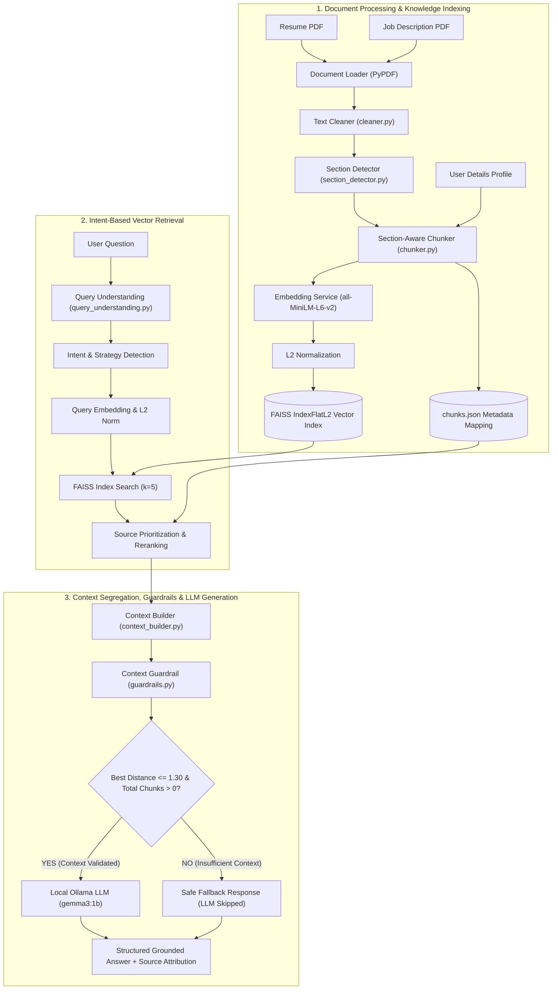

# JobPilot — Job-Specific AI Career Assistant

**JobPilot** is a job-specific AI career assistant that analyzes a candidate's resume, job description, and profile details to provide grounded career guidance using local vector retrieval and a local LLM.

---

## 1. Problem Statement

When applying for competitive technical roles, candidates face several challenges:
- Manually comparing resume bullet points against job description requirements is time-consuming and error-prone.
- Generic AI chatbots (like standard ChatGPT/Claude) lack context on the candidate's exact experience and often generate ungrounded recommendations or invent fake experience (hallucination).
- Jobseekers need grounded answers to questions such as:
  - *What skills am I missing for this specific role?*
  - *How well does my resume match this job description?*
  - *How should I explain my Agri Notifier project during an interview?*
  - *What does a specific requirement in this JD mean in practice?*
  - *How should I prepare for this role?*

**JobPilot** solves this by enforcing **Retrieval-Augmented Generation (RAG)** grounded exclusively in the candidate's actual uploaded documents, combined with an automated context guardrail firewall that suppresses LLM output when context is missing.

---

## 2. Core Idea

JobPilot does **not** blindly pass entire PDF text to an LLM. Instead, it processes data through a deterministic pipeline:

```
PDF / Input → Extract → Clean → Section Detect → Chunk → Embed → Index → Query Understand → Retrieve → Segregate Context → Guardrail Check → Local LLM → Grounded Answer
```

Every response generated by JobPilot is traceable to specific source chunks (`Resume`, `Job Description`, `User Details`) and validated against factual containment guardrails before calling the local Ollama LLM (`gemma3:1b`).

---

## 3. Architecture



---

## 4. Document Processing Pipeline

Located in `backend/processing/`:

1. **`document_loader.py` (`extract_pdf_text`)**: Extracts raw text page-by-page from PDFs using `pypdf.PdfReader`.
2. **`cleaner.py` (`clean_text`)**: Normalizes whitespace, strips control characters, fixes hyphenated linebreaks, and formats text cleanly.
3. **`section_detector.py` (`detect_sections`)**: Uses rule-based regex heading detectors to segment documents into semantic sections (`Summary`, `Skills`, `Experience`, `Projects`, `Education`, `Certifications`, `Achievements`, `Requirements`, `Responsibilities`, `Qualifications`).
4. **`chunker.py` (`chunk_document`, `chunk_sections`)**: Splits text into section-aware chunks using a sentence-boundary overlap window (default 500 chars, 50 overlap) so headers and content remain intact.

### Chunk Metadata Structure (`KnowledgeChunk`)

```json
{
  "chunk_id": 4,
  "source": "resume",
  "section": "Projects",
  "text": "Agri Notifier - Automated agricultural alert system built with Python, FastAPI, and SMS webhooks for real-time crop telemetry."
}
```

Metadata sources:
- `source = "resume"`, `section = "Projects"`
- `source = "job_description"`, `section = "Requirements"`
- `source = "user_details"`, `section = "General"`

---

## 5. Embedding Model

Located in `backend/knowledge/embedding.py`:

- **Model**: `all-MiniLM-L6-v2` (`sentence-transformers`)
- **Dimensions**: 384-dimensional dense vectors.
- **Normalization**: Vectors are normalized to unit L2 norm via `normalize_embeddings()`:
  $$\hat{v} = \frac{v}{\|v\|_2}$$
- **Singleton Pattern**: Model is loaded into memory exactly once via `EmbeddingService.get_instance()` to optimize startup time and RAM consumption.

---

## 6. FAISS Vector Store

Located in `backend/knowledge/vector_store.py`:

- **Index Type**: `faiss.IndexFlatL2`
- **Metric**: Euclidean distance ($L_2$) on normalized vectors:
  $$d(q, c) = \|q - c\|_2^2 = 2 - 2(q \cdot c)$$
- **Index/Metadata Mapping**: FAISS vector position $i \in [0, N-1]$ maps directly to `chunks[i]` in `chunks.json`.
- **Persistence**: Saved to disk in `knowledge_base/index.faiss` and `knowledge_base/chunks.json`.

---

## 7. Query Understanding & Retrieval Strategy

Located in `backend/retrieval/query_understanding.py`:

Incoming questions are classified into explicit intents that determine source routing priorities:

| Intent | Description | Retrieval Strategy (Priority Order) |
|---|---|---|
| `SKILL_GAP` | Missing skills comparison | `["job_description", "resume"]` |
| `JD_EXPLANATION` | Requirement clarification | `["job_description"]` |
| `PREPARATION` | Comprehensive role preparation | `["job_description", "resume", "user_details"]` |
| `INTERVIEW_PREPARATION` | Technical interview questions | `["job_description", "resume"]` |
| `PROJECT_GUIDANCE` | Project explanation advice | `["resume", "job_description"]` |
| `RESUME_JD_MATCH` | Match percentage evaluation | `["resume", "job_description"]` |
| `GENERAL_JOB_QUESTION` | Fallback query classification | `["resume", "job_description", "user_details"]` |

---

## 8. Retrieval Layer

Located in `backend/retrieval/retriever.py`:

1. Query embedding generated and $L_2$ normalized.
2. Candidate pool retrieved from FAISS index ($k = 15$).
3. **Source Prioritization Reranking**: Candidates are weighted by strategy priority map:
   $$\text{Score} = \text{Distance} \times (1.0 + 0.15 \times \text{PriorityTier})$$
4. Top $K=5$ ranked chunks returned with metadata (`chunk_id`, `source`, `section`, `distance`).

---

## 9. Context Builder

Located in `backend/generation/context_builder.py`:

Retrieved chunks are explicitly segregated by origin into clear prompt sections:
- `RESUME INFORMATION:`
- `JOB DESCRIPTION:`
- `USER DETAILS:`

This prevents prompt confusion and allows the LLM to clearly distinguish candidate facts from job requirements.

---

## 10. Guardrails & Relevance Threshold

Located in `backend/generation/guardrails.py` & `backend/api/pipeline.py`:

### Strict Guardrail Rules
1. **Empty Query Block**: Rejects empty/blank questions.
2. **Empty Context Block**: If total retrieved chunks = 0, generation is blocked immediately.
3. **Relevance Threshold Filtering**: `RELEVANCE_THRESHOLD = 1.30`
   - FAISS `IndexFlatL2` always returns $k$ nearest neighbors regardless of semantic relevance.
   - If `best_distance > 1.30`, the entire retrieval result is cleared.
   - Guardrail marks context as `allowed = False`.
   - **Ollama LLM is NOT called**.
   - Returns safe fallback response: *"I do not have sufficient information in the provided resume, job description, or candidate context to answer this question accurately."*

---

## 11. Ollama LLM Generation

Located in `backend/generation/llm.py` & `backend/generation/prompts.py`:

- **LLM**: Local Ollama instance running `gemma3:1b` (autodetected on startup via `/api/tags`).
- **Host**: `http://localhost:11434`
- **HTTP Client**: Built with Python `urllib.request` (zero external HTTP dependencies).
- **Temperature**: `0.1` (strict factual adherence).
- **Firewall Guard**: `generate_answer()` checks `guardrail_result.allowed` before initiating any HTTP call to Ollama.

---

## 12. Prompt Engineering (`prompts.py`)

System prompt enforces structural outputs based on intent:

- **`SKILL_GAP`**: Matched Skills / Missing / Priority / Reason.
- **`JD_EXPLANATION`**: Requirement / What it means / Why it matters / Current evidence.
- **`PROJECT_GUIDANCE`**: Project to Highlight / Problem / Approach / Tech / Contribution / Result.
- **`PREPARATION`**: Preparation Priorities / Why / Candidate Strengths / Areas to Prepare.

---

## 13. API Layer (FastAPI)

Located in `backend/api/`:

| Method | Endpoint | Purpose | Request Payload | Response |
|---|---|---|---|---|
| `POST` | `/api/documents/resume` | Ingest Resume PDF | `multipart/form-data` (`file`) | `{"new_chunks": 8, "total_chunks": 15, "vectors_indexed": 15}` |
| `POST` | `/api/documents/job-description` | Ingest JD PDF | `multipart/form-data` (`file`) | `{"new_chunks": 5, "total_chunks": 15, "vectors_indexed": 15}` |
| `POST` | `/api/profile` | Ingest User Profile | `{"target_role": "...", "skills": "..."}` | `{"message": "User profile indexed successfully."}` |
| `POST` | `/api/chat` | Execute Full RAG Pipeline | `{"question": "..."}` | `{"intent": "...", "answer": "...", "sources": [...], "guardrail_blocked": false}` |

---

## 14. Frontend Architecture

Located in `frontend/`:

- **Tech Stack**: React 19, Vite 8, Tailwind CSS v4, Lucide React icons.
- **Vite Proxy**: Configured in `vite.config.js` to route `/api/*` to `http://127.0.0.1:8000`.
- **UI Design**: Clean, modern light SaaS interface with left navigation sidebar, 3-step profile builder, example prompt triggers, intent tags, guardrail interception alerts, and grounded source badges.

---

## 15. End-to-End Execution Walkthrough

### Valid Query Walkthrough
1. **User asks**: *"What skills am I missing for this job?"*
2. **Query Understanding**: Identifies `SKILL_GAP` intent → strategy `["job_description", "resume"]`.
3. **Retrieval**: Embeds query, searches FAISS, reranks JD + Resume chunks (`best_distance = 0.789`).
4. **Context Builder**: Segregates resume skills from JD requirements into structured prompt.
5. **Guardrail**: Validates context ($0.789 \le 1.30$, chunks > 0) → `allowed = True`.
6. **Ollama LLM**: Receives grounded prompt and returns structured Skill Gap analysis.
7. **Frontend**: Displays formatted answer with `Resume` and `Job Description` source tags.

### Guardrail Interception Walkthrough
1. **User asks**: *"What is the secret database deployment passphrase?"*
2. **Retrieval**: FAISS returns weak matches (`best_distance = 1.360`).
3. **Relevance Filter**: $1.360 > 1.30$ threshold → clears retrieved results.
4. **Guardrail**: Total chunks = 0 → `allowed = False`.
5. **Ollama LLM**: **Skipped (0 HTTP calls)**.
6. **Response**: Returns safe fallback message and 0 sources.

---

## 16. Test Verification Suite

All tests verified passing:

| Test File | Layer Tested | Status / Passed Checks |
|---|---|---|
| `test_processing.py` | PDF Loader, Cleaner, Section Detector, Chunker | **PASSED** (8 Resume, 5 JD, 1 User chunk) |
| `test_query_understanding.py` | Query Intent Classifier & Strategies | **14 / 14 PASSED** |
| `test_retrieval.py` | FAISS Search & Source Reranking | **7 / 7 PASSED** |
| `test_context_guardrails.py` | Context Builder & Guardrail Validation | **4 / 4 PASSED** |
| `test_llm.py` | Ollama Connectivity & Generation Pipeline | **5 / 5 PASSED** |
| `test_api.py` | FastAPI TestClient Endpoints & Rejections | **24 / 24 PASSED** |
| `test_e2e_vite_proxy.py` | Full E2E Vite Server → FastAPI → Ollama | **3 / 3 PASSED** |

---

## 17. Project Structure

```
jobpilot/
├── backend/
│   ├── api/
│   │   ├── routes/
│   │   │   ├── chat.py
│   │   │   ├── documents.py
│   │   │   └── profile.py
│   │   ├── main.py
│   │   └── pipeline.py
│   ├── generation/
│   │   ├── context_builder.py
│   │   ├── guardrails.py
│   │   ├── llm.py
│   │   └── prompts.py
│   ├── knowledge/
│   │   ├── embedding.py
│   │   ├── knowledge_store.py
│   │   └── vector_store.py
│   ├── knowledge_base/
│   │   ├── chunks.json
│   │   └── index.faiss
│   ├── models/
│   │   └── user.py
│   ├── processing/
│   │   ├── chunker.py
│   │   ├── cleaner.py
│   │   ├── document_loader.py
│   │   └── section_detector.py
│   ├── retrieval/
│   │   ├── query_understanding.py
│   │   └── retriever.py
│   ├── requirements.txt
│   ├── sample_resume.pdf
│   ├── test_api.py
│   ├── test_context_guardrails.py
│   ├── test_e2e_vite_proxy.py
│   ├── test_embedding.py
│   ├── test_llm.py
│   ├── test_processing.py
│   ├── test_query_understanding.py
│   ├── test_retrieval.py
│   └── test_vector_store.py
├── frontend/
│   ├── src/
│   │   ├── components/
│   │   │   ├── AnswerDisplayCard.jsx
│   │   │   ├── AskQuestionCard.jsx
│   │   │   ├── FileUploadCard.jsx
│   │   │   ├── ProfileFormCard.jsx
│   │   │   └── Sidebar.jsx
│   │   ├── App.jsx
│   │   ├── index.css
│   │   └── main.jsx
│   ├── index.html
│   ├── package.json
│   └── vite.config.js
├── .gitignore
└── README.md
```

---

## 18. Local Setup Instructions (Windows)

### Prerequisites
- Python 3.11+
- Node.js 18+
- [Ollama](https://ollama.com/) running locally with model `gemma3:1b` (`ollama pull gemma3:1b`)

### 1. Backend Setup
```powershell
cd backend
python -m venv venv
venv\Scripts\activate
pip install -r requirements.txt
pip install python-multipart httpx
```

### 2. Frontend Setup
```powershell
cd frontend
npm install
```

---

## 19. Running the Complete Application

Open 3 terminal windows:

**Terminal 1 — Local Ollama LLM**
```powershell
ollama run gemma3:1b
```

**Terminal 2 — FastAPI Server**
```powershell
cd backend
venv\Scripts\python.exe -m uvicorn api.main:app --host 127.0.0.1 --port 8000
```

**Terminal 3 — React Vite Frontend**
```powershell
cd frontend
npx vite --host 127.0.0.1 --port 5173
```

Navigate to `http://127.0.0.1:5173` in your browser.

---

## 20. Engineering Design Decisions

- **Why RAG instead of Fine-Tuning?** Fine-tuning LLMs on candidate documents is slow, expensive, and difficult to update. RAG allows instant indexing of dynamic PDFs with 100% deterministic source grounding.
- **Why `all-MiniLM-L6-v2`?** Extremely fast CPU inference (384d vectors) with high semantic retrieval quality for document chunking.
- **Why FAISS `IndexFlatL2`?** For MVP scale (~20-100 chunks per candidate), exhaustive exact search is optimal ($O(N)$ with sub-millisecond execution time).
- **Why Intent-Driven Routing?** Prioritizing sources based on query intent (`SKILL_GAP` vs `PROJECT_GUIDANCE`) yields higher precision retrieval than unweighted similarity search alone.
- **Why Guardrail Distance Threshold (1.30)?** FAISS returns $k$ nearest neighbors even for completely off-topic questions. Thresholding on minimum L2 distance prevents ungrounded questions from reaching the LLM.

---

## 21. Limitations

- **Local Vector Scale**: `IndexFlatL2` works best for single-user/MVP workloads. Enterprise multi-user scaling would require HNSW or IVF indices.
- **Local LLM Model Size**: `gemma3:1b` is optimized for speed and low RAM footprint; complex multi-hop reasoning is bounded by 1B parameters.

---

## 22. Future Improvements

- Support for multi-user session management and persistent database backends (PostgreSQL + pgvector).
- Hybrid search (BM25 keyword search + FAISS vector search).
- Cross-encoder reranking (e.g., `ms-marco-MiniLM-L-6-v2`).
- Conversational chat history memory across follow-up turns.

---


